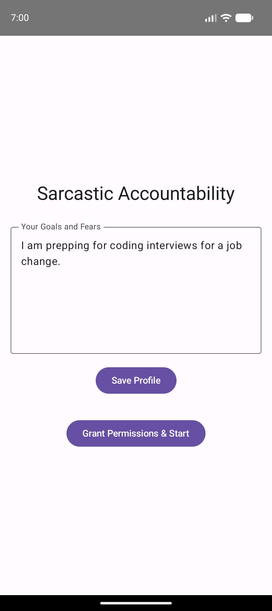
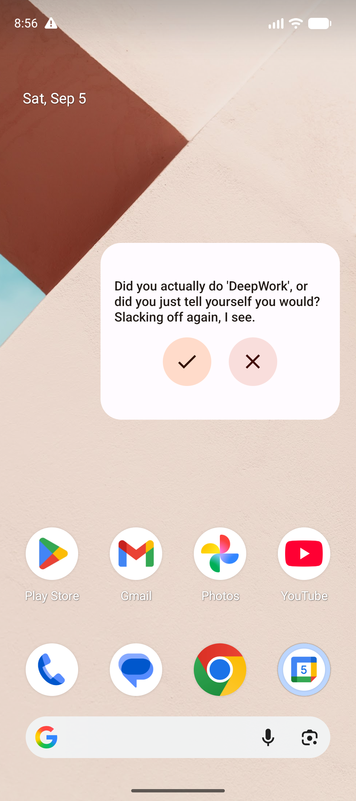
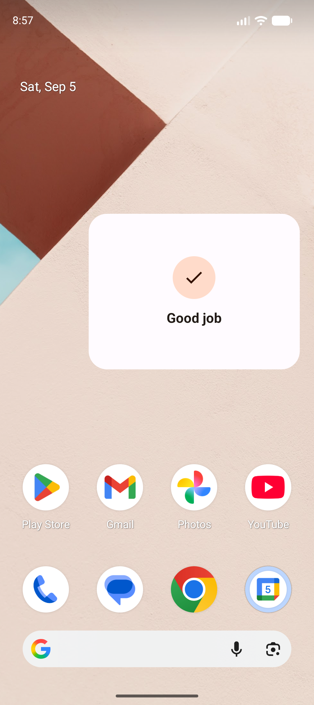

# DidIt?

A strict, sarcastic accountability partner for Android. It watches your calendar and, when a time-blocked event is happening, runs a **locally bundled LLM (Gemma 3 270M via LiteRT/MediaPipe)** to generate a biting, guilt-inducing prompt asking whether you actually did the thing — delivered as a notification and a home-screen widget.

Everything runs **on-device**. No network, no accounts, no data leaves the phone.

## Screenshots

| Setup | Widget — nag | Widget — "Good job" |
|:---:|:---:|:---:|
|  |  |  |
| Profile + permissions | Material 3 widget with tick/cross | Tapping the tick acknowledges |

## How it works

```
Calendar event ──► (content-URI observer)   ──► arm exact alarm
              └──► (exact alarm at start+2m) ──► AccountabilityWorker
                                                   ├─ read ongoing/recent event (CalendarContract)
                                                   ├─ generate nag (Gemma 3 270M, LiteRT)
                                                   ├─ post high-priority notification
                                                   └─ update Glance widget
```

- **Calendar sync** — `CalendarInteractor` queries `CalendarContract` for the current/recently-ended, non-all-day event.
- **Triggering** — a WorkManager **content-URI trigger** on the calendar wakes the app the moment an event is added/edited (even from a dead process) and arms an **`AlarmManager` exact alarm** ~2 minutes into the event. A 15-minute periodic worker remains as a safety net.
- **Inference** — `LlmEngine` copies the bundled `.litertlm` model to internal storage, loads it with MediaPipe `LlmInference`, and generates in a **fresh session per call** using a **few-shot** prompt (task + two worked examples) wrapped in Gemma's chat template. Runs as **expedited/foreground work** so the ~300 MB model load isn't killed mid-flight.
- **Presentation** — a high-priority notification plus a **Jetpack Glance** Material 3 widget with tick ("did it" → "Good job") and cross ("skipped" → reset) buttons.
- **Profile** — a short bio saved in `DataStore` (personalization is currently held back on the 270M model; see Caveats).

## Tech stack

- Kotlin, Jetpack **Compose** (setup UI), Jetpack **Glance** (widget)
- **WorkManager** (expedited work, content-URI triggers) + **AlarmManager** (exact alarms)
- **DataStore** (profile + widget state)
- **MediaPipe `tasks-genai` 0.10.35** running a Gemma 3 270M `.litertlm` model (LiteRT-LM)

## Project layout

| File | Responsibility |
|---|---|
| `MainActivity.kt` | Compose setup screen: profile, permissions, start scheduling |
| `CalendarInteractor.kt` | Query current/next calendar events |
| `EventScheduler.kt` | Arm exact alarms; register the calendar content observer |
| `AlarmReceiver.kt` | Run a check on alarm fire; re-register on boot |
| `CalendarObserverWorker.kt` | React to calendar changes and re-arm |
| `AccountabilityWorker.kt` | Orchestrate: read event → LLM → notify + widget |
| `LlmEngine.kt` | Load the model; few-shot generation |
| `AccountabilityWidget.kt` | Glance Material 3 widget + actions |
| `*Repository.kt` | DataStore for profile and widget state |

## Build & run

```bash
# The model is tracked with Git LFS — install it and pull the model first.
git lfs install
git lfs pull

# Build the debug APK
./gradlew assembleDebug

# Install on a connected device/emulator
adb install -r app/build/outputs/apk/debug/didit-debug.apk
```

Then open the app, enter a short profile, and tap **Grant Permissions & Start**. Add the widget to your home screen.

- **Model:** `app/src/main/assets/gemma3-270m-it-q8.litertlm` (~305 MB, Git LFS). Swap in another LiteRT `.litertlm` by replacing the file and updating `assetName` in `LlmEngine.kt`.
- **minSdk 26, targetSdk 34.**

### Quick manual test (emulator)

```bash
# create a local calendar if none exists, then an event starting in 2 minutes
NOW=$(( $(date +%s) * 1000 )); START=$(( NOW + 2*60*1000 )); END=$(( NOW + 60*60*1000 ))
adb shell content insert --uri content://com.android.calendar/events \
  --bind calendar_id:i:1 --bind title:s:DeepWork \
  --bind dtstart:l:$START --bind dtend:l:$END \
  --bind eventTimezone:s:UTC --bind allDay:i:0
```

The content observer arms an alarm on insert; the nag appears on the widget/notification ~2 minutes after the event starts — no app interaction needed.

## CI

`.github/workflows/android-debug.yml` builds the debug APK on every push (checkout with LFS), uploads it as an artifact, and — on `main` — publishes a prerelease with the APK attached.

## Caveats

- **270M is a small model.** Even with few-shot prompting the tone occasionally drifts or softens. Larger gains would come from a Gemma 1B+ `.litertlm`. Profile personalization is currently omitted from the prompt because it degraded output on this model.
- **OEM battery managers** (Xiaomi, Samsung, etc.) may kill background apps or block alarms; exempting the app from battery optimization is the reliable fix.
- **Exact alarms** need `USE_EXACT_ALARM` (auto-granted for reminder-style apps on Android 14+); otherwise it falls back to inexact.
- The bundled model makes the APK ~350 MB — fine for sideloading, but too large for Play's base-APK limits (would need asset delivery or on-first-run download).

> This app is intentionally harsh for fun. It's a demo of on-device generative AI, not a wellbeing tool.
